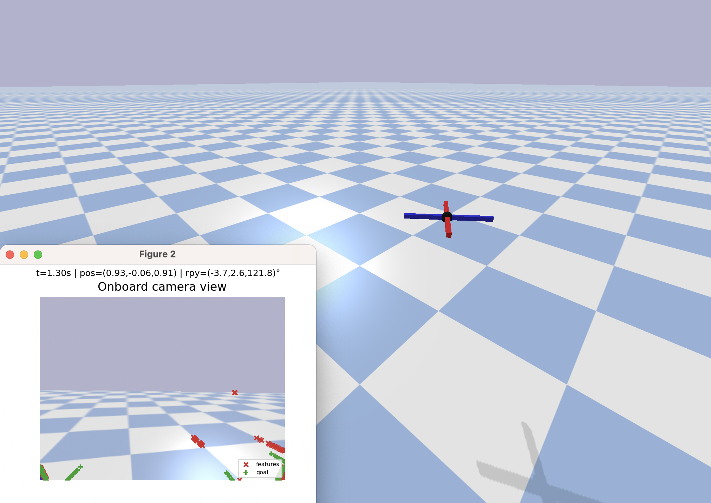
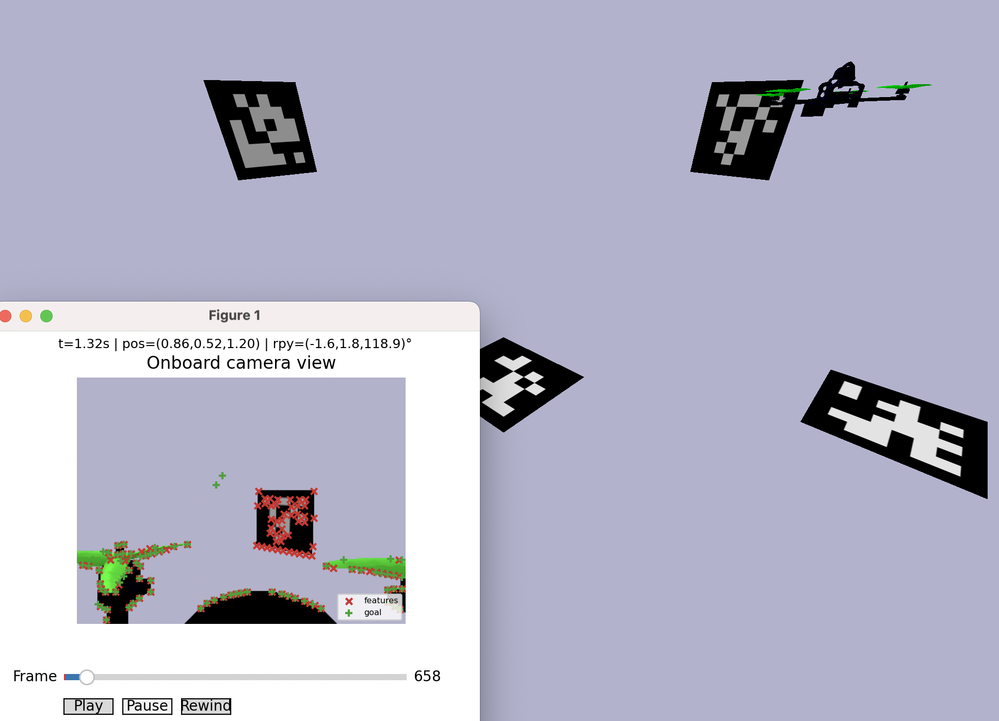
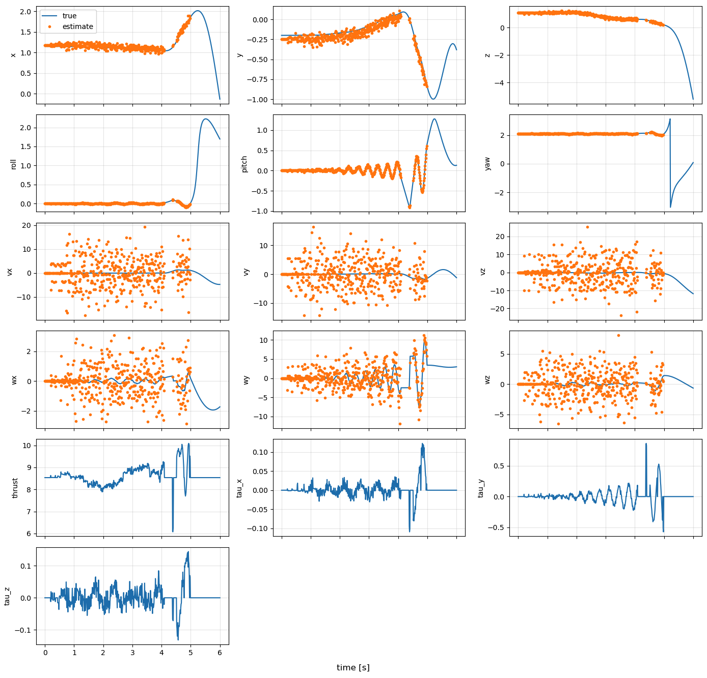
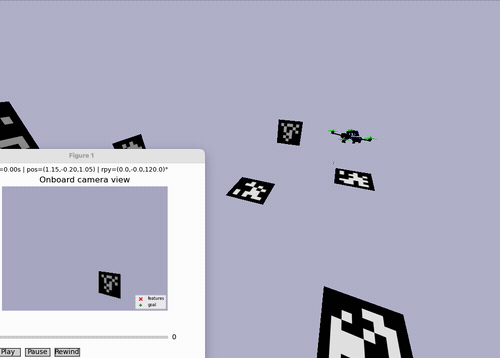
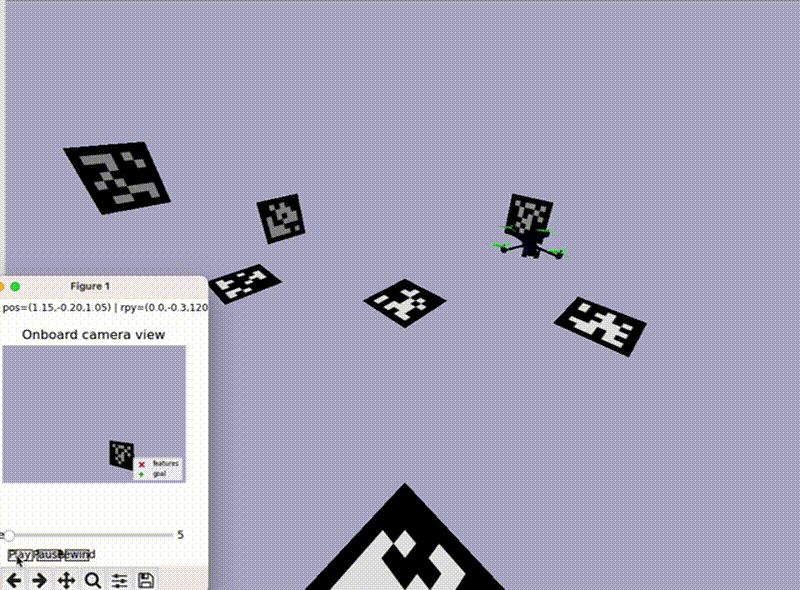

# Visual Navigation for Aerial Autonomous Vehicles (VNAAV)

This repository contains  reference python implementations for visual control of quadrotors. The primary focus is a lightweight quadrotor simulator with interchangeable controllers and sensors (including a PyBullet camera), plus the supporting code for perception and navigation.

Key capabilities include:
- A small SE(3) quadrotor simulator with a three-rate loop (plant, sensor, controller). 
- PyBullet playback with an onboard camera and AprilTag/Aruco feature detection (PBVS controller).
- Multiple controller modes (SE3 position, random, PBVS, smoothed PBVS) and configurable trajectories.
- Reusable scene/camera helpers for swapping drone visuals and environments.


| PyBullet  | Editable Worlds | Drone Cameras |
| --- | --- | --- |
|  |  |  |
|  |  | 

## Requirements

Core requirements (headless simulation):
- Python 3.x
- `numpy`
- `matplotlib` (for plotting/animation)

PyBullet playback:
- `pybullet`

PBVS (AprilTag/Aruco) controller:
- `opencv-contrib-python` (for `cv2.aruco`)

## Usage examples

Headless simulation (matplotlib only):
```bash
python -m py_labs.quadrotor_sim.run_simulation --duration 20 --controller-rate 200 --sim-dt 0.002
```

SE(3) controller with PyBullet playback:
```bash
python -m py_labs.quadrotor_sim.run_bullet_simulation --controller se3 --duration 20
```

Random controller for quick stress testing:
```bash
python -m py_labs.quadrotor_sim.run_bullet_simulation --controller random --duration 10
```

PBVS controller (AprilTag/Aruco) with camera observations:
```bash
python -m py_labs.quadrotor_sim.run_bullet_simulation --controller pbvs --duration 20
```

Smoothed PBVS controller (EMA on derived velocities):
```bash
python -m py_labs.quadrotor_sim.run_bullet_simulation --controller smoothed-pbvs --duration 20
```

Use the A2RL drone URDF and physical parameters:
```bash
python -m py_labs.quadrotor_sim.run_bullet_simulation --controller se3 --a2rl
```

Hover trajectory with a fixed yaw:
```bash
python -m py_labs.quadrotor_sim.run_bullet_simulation --trajectory hover --hover-yaw 0.5
```

## Simulator architecture

At a high level the system is wired as:

```
TrajectoryCommand -> Controller -> ControlInput -> Plant (QuadrotorPlant)
                                        |                 |
                                        v                 v
                               Sensor/Scene/Camera      SimulationLog
```

Key components:
- Plant: `py_labs/quadrotor_sim/plant.py` integrates rigid-body quadrotor dynamics.
- Controller: `py_labs/quadrotor_sim/controller.py` provides SE3 position control, random control, PBVS (vision-based) control, and smoothed PBVS control.
- Simulator: `py_labs/quadrotor_sim/simulator.py` runs independent plant, sensor, and controller rates.
- Scene/Camera: `py_labs/quadrotor_sim/scene.py` owns the PyBullet scene, camera pose, and rendering. The camera uses a render frame for PyBullet and converts to OpenCV conventions for pose estimation.

## Command line reference

### Headless simulation (`run_simulation.py`)

```bash
python -m py_labs.quadrotor_sim.run_simulation [options]
```

| Option | Default | Description |
| --- | --- | --- |
| `--duration` | `20.0` | Total simulation time (seconds). |
| `--radius` | `1.0` | Circle radius for circular trajectory. |
| `--height` | `1.2` | Circle altitude for circular trajectory. |
| `--angular-rate` | `0.4` | Angular rate (rad/s) for circular trajectory. |
| `--controller-rate` | `200.0` | Controller update rate in Hz. |
| `--sim-dt` | `0.002` | Plant integration time step (seconds). |
| `--trajectory` | `circle` | Trajectory type: `circle` or `hover`. |
| `--hover-x` | `0.0` | Hover x position (meters). |
| `--hover-y` | `0.0` | Hover y position (meters). |
| `--hover-height` | `3.0` | Hover z position (meters). |
| `--hover-yaw` | `0.0` | Hover yaw (radians). |

### PyBullet playback (`run_bullet_simulation.py`)

```bash
python -m py_labs.quadrotor_sim.run_bullet_simulation [options]
```

| Option | Default | Description |
| --- | --- | --- |
| `--duration` | `20.0` | Total simulation time (seconds). |
| `--radius` | `1.0` | Circle radius for circular trajectory. |
| `--height` | `1.2` | Circle altitude for circular trajectory. |
| `--angular-rate` | `0.4` | Angular rate (rad/s) for circular trajectory. |
| `--controller-rate` | `200.0` | Controller update rate in Hz. |
| `--sim-dt` | `0.002` | Plant integration time step (seconds). |
| `--noise` | `false` | Use a noisy state sensor. |
| `--trajectory` | `circle` | Trajectory type: `circle` or `hover`. |
| `--hover-x` | `0.0` | Hover x position (meters). |
| `--hover-y` | `0.0` | Hover y position (meters). |
| `--hover-height` | `3.0` | Hover z position (meters). |
| `--hover-yaw` | `None` | Hover yaw (radians). Defaults to plant initial yaw. |
| `--playback-stride` | `1` | Skip this many frames during playback. |
| `--max-features` | `200` | Max features per frame (feature extractor). |
| `--feature-min-distance` | `5.0` | Minimum pixel spacing between detected features. |
| `--controller` | `se3` | Controller choice: `se3`, `random`, `pbvs`, `smoothed-pbvs`. |
| `--a2rl` | `false` | Use A2RL drone URDF and physical parameters. |
| `--aruco_scene` | `false` | Reserved flag for ArUco scene generation (not wired in the entrypoint). |
| `--basic_drone` | `false` | Force basic drone visual (default if `--a2rl` not set). |

## References 

The plant model and the SE(3) controller are from [MIT's VNAV course](https://vnav.mit.edu/).